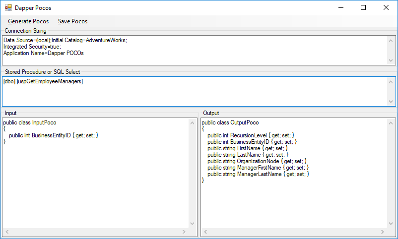
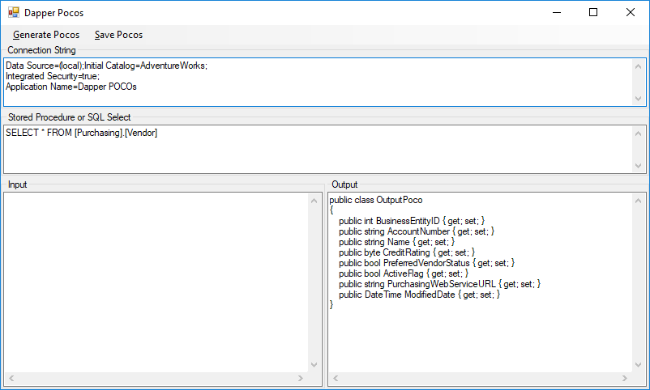

# dapper-pocos

A small utility for generating POCOs for use with Dapper connecting to SQL Server.

Dapper POCOs uses "[sp_HELP](https://docs.microsoft.com/en-us/sql/relational-databases/system-stored-procedures/sp-help-transact-sql)" and "[sp_describe_first_result_set](https://docs.microsoft.com/en-us/sql/relational-databases/system-stored-procedures/sp-describe-first-result-set-transact-sql)" in SQL Server to get the input and output parameters for a given stored procedure or query. The [SQL Server data types](https://docs.microsoft.com/en-us/dotnet/framework/data/adonet/sql-server-data-type-mappings) are mapped to their equivalent [C# data types](https://docs.microsoft.com/en-us/dotnet/csharp/language-reference/keywords/built-in-types-table), with [xml mapped to XDocument](https://stackoverflow.com/questions/1542073/xdocument-or-xmldocument/1542101#1542101).

## Screen Shots

**Stored Procedure Example**

**Select Statement Example**

